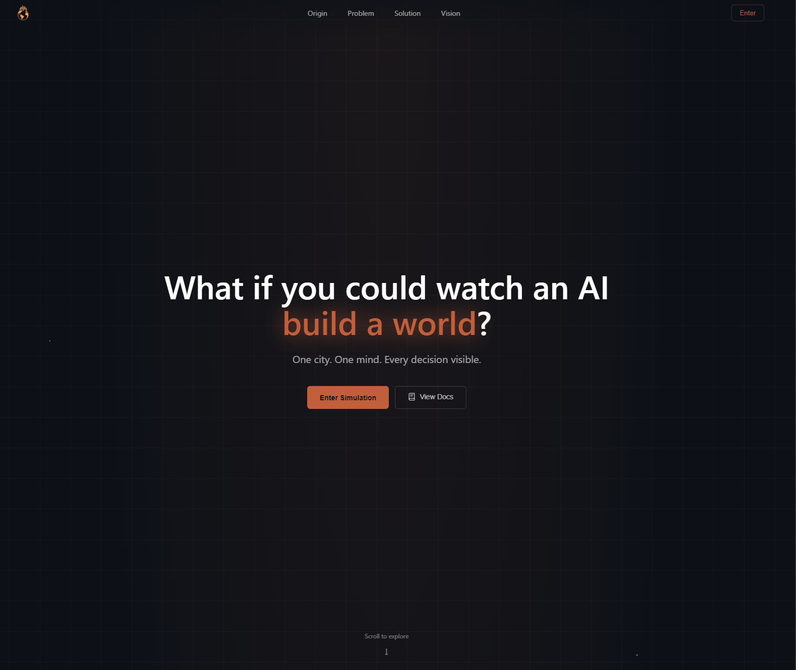

<div align="center">


# DegentechLandingFront

### Software y hardware para la economía autónoma

      

[**🌐 Ver en vivo**](https://degentech.co) · [**📦 Repositorio**](https://github.com/Harkor421/DegentechLandingFront)

</div>

---

## 📖 Sobre el proyecto

Landing de **DegenTech**: presenta la agencia, sus capacidades, proyectos y servicios, con una terminal en vivo, scroll suave y animaciones de GSAP. Bilingüe.

<p align="center"></p>

## ✨ Qué hace

- Terminal en vivo en el hero y secciones de capacidades
- Páginas dinámicas por proyecto y por servicio
- Scroll suave con Lenis y animaciones con GSAP
- Bilingüe mediante un provider de idioma
- SEO con sitemap y robots · Next.js con React 19

## 🧰 Stack

| | |
|---|---|
| **Lenguajes y runtime** |   |
| **Frontend** |     |
| **Infraestructura** |  |

## 📂 Estructura

```
app/about            # Rutas de la aplicación (App Router)
app/blog             # Rutas de la aplicación (App Router)
components/sections  # Componentes de interfaz
components/ui        # Componentes de interfaz
```

## 🚀 Empezar

```bash
git clone https://github.com/Harkor421/DegentechLandingFront.git
cd DegentechLandingFront
npm install
npm run dev
```

## 📜 Scripts

| Comando | Qué hace |
|---|---|
| `npm run dev` | Servidor de desarrollo con recarga en caliente |
| `npm run build` | Compila para producción |
| `npm run start` | Arranca la aplicación |
| `npm run lint` | Revisa el estilo del código |

## ☁️ Despliegue

- **Vercel** (`vercel.json` en el repo)

---

<div align="center">

Hecho por [**Samir González**](https://github.com/Harkor421)

</div>
